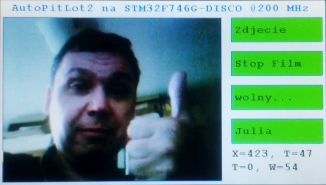

# Kamera na STM32F746G-DISCO
Demonstracja wykorzystania kamery OV9655 1,3Mpix w trybie ciągłej transmisji oraz zdjęcia na STM32F746G-DISCO

# Znane problemy,
które trzeba poprawić ręcznie po wygenerowaniu kodu przez Cube MX:
1) W pliku ethernetif.c zmienić: (wiersz 95) #define ETH_RX_BUFFER_CNT             12U na 10U, ponieważ brakuje pamięci RAM2 na 12 buforów
2) Ręcznie skopiować katalog Utilities zawierający czcionki, ponieważ usuwa go automatycznie
3) W main.c zakomentować wiersz 203:  void MX_SDMMC1_SD_Init(void); ponieważ jest jakiś błąd obsługi karty SD.
